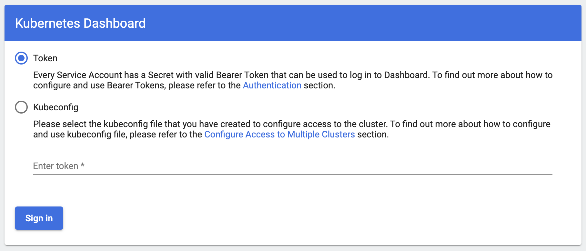

I wanted to write a post about how I built my own Apache Spark environment on AWS using Amazon EMR, Amazon EKS, and the AWS Cloud Development Kit (CDK). This stack also creates an EMR Studio environment that can be used to build and deploy data notebooks.

_Disclaimer: I work for AWS on the EMR team and built this stack for my [various demos](https://www.youtube.com/channel/UCKtlXVZC2DqzayRlZYLObZw) and it is not intended for production use-cases._ 🙏

Also note that the commands below are for demonstration purposes only, the full code is available in my [demo-code/cdk/big-data-stack](https://github.com/dacort/demo-code/tree/main/cdk/big-data-stack) repository.

## Overview

At re:Invent 2020, AWS introduced EMR on EKS - a way to run Apache Spark workloads on Kubernetes using managed services. Once you're up and running, you can submit a Spark job to EMR on EKS with a single AWS CLI command. But provisioning EKS, ensuring it has all the necessary resources to run your jobs, creating IAM roles and Kubernetes service accounts, and linking those back to EMR can be a lot of manual effort. Using AWS CDK, we can easily provision the entire stack:

- A VPC in 3 availability zones
- An EKS cluster with the following addons
  - Cluster Autoscaler
  - Kubernetes Dashboard
- An EMR virtual cluster connected to our EKS cluster
- An EMR Studio environment
    - A Service Catalog cluster template

This is the high-level architecture of what the resulting stack will look like. Now let's walk through each different piece.


## VPC

This is probably the easiest part of the whole setup. In CDK, you can provision a VPC with the following code:

```python
from aws_cdk import aws_ec2 as ec2

ec2.Vpc(self, "EMRDemos", max_azs=3)
```

And you're done. 🎉 In my stack, I make the resulting `ec2.Vpc` object an attribute on the VPC stack so I can use it in other parts of my stack.

```python
app = cdk.App()

vpc = VPCStack(app, "VPCStack")
eks = EKSStack(app, "EKSStack", vpc.vpc)
emr_containers = EMRContainersStack(app, "EMRContainers", vpc.vpc, eks.cluster)
emr_studio = EMRStudio(app, "EMRStudio", vpc.vpc, "big-data-studio")

app.synth()
```

Let's walk through what happens in each of these stacks.

## EKSStack

This one is a little more complex. In many cases, you only need to stand up your EKS cluster once and you'll use that in perpetuity. But there certainly are cases where you might provision multiple EKS stacks for security or organizational reasons. Provisioning an EKS stack in CDK is relatively straightforward.

- First, provision the EKS Cluster

```python
from aws_cdk import (
    aws_eks as eks,
    aws_ec2 as ec2,
    aws_iam as iam,
)

cluster = eks.Cluster(
    self,
    "EksForSpark",
    cluster_name="data-team",
    version=eks.KubernetesVersion.V1_19,
    default_capacity=0,
    endpoint_access=eks.EndpointAccess.PUBLIC_AND_PRIVATE,
    vpc=vpc,
    vpc_subnets=[ec2.SubnetSelection(subnet_type=ec2.SubnetType.PRIVATE)],
)
```

- Then, add one or more [managed node groups](https://docs.aws.amazon.com/eks/latest/userguide/managed-node-groups.html).

```python
nodegroup = cluster.add_nodegroup_capacity(
    "base-node-group",
    instance_types=[ec2.InstanceType("m5.xlarge")],     # You could add additional instance types here
    min_size=1,                                         # The node group can scale to 1
    max_size=20,                                        # And up to 20 nodes
    disk_size=50,                                       # Give each node 50gb of disk
)
```

- You'll also likely want to grant an IAM role admin access to the cluster

```python
admin_iam_role_name = "Admin"           # This role must already exist in your AWS account
account_id = cdk.Aws.ACCOUNT_ID
admin_role = iam.Role.from_role_arn(
    self, "admin_role", f"arn:aws:iam::{account_id}:role/{admin_role_name}"
)
cluster.aws_auth.add_masters_role(admin_role)
```

### Cluster Autoscaler

Finally, a critical component to install is the [Cluster Autoscaler](https://docs.aws.amazon.com/eks/latest/userguide/cluster-autoscaler.html). The EKS documentation shows how to deploy it using the `kubectl` command, but I wanted to wrap this up in the CDK stack. I also ran into [this issue](https://github.com/kubernetes/autoscaler/issues/3901) where a Helm chart for 1.19 doesn't exist. 🙁.

So I created an [autoscaler module](https://github.com/dacort/demo-code/blob/main/cdk/big-data-stack/plugins/eks/autoscaler.py) that I can easily apply to my cluster and node groups.

```python
cluster_name = "data-team"

ClusterAutoscaler(
    cluster_name, self, cluster, [nodegroup]
).enable_autoscaling()
```

This code performs the following steps in order to enable the cluster autoscaler on an EKS cluster:
- Adds tags to the passed node groups to enable auto discovery
- Creates a new IAM Role that can change Auto Scaling Groups
- Creates a Kubernetes service account
- Creates a new cluster-autoscaler deployment
- Creates the corresponding rbac rules

### Kubernetes Dashboard

The Kubernetes Dashboard is also extremely valuable to be able to examine what's happening in your EKS cluster. It's easy to install by using the CDK `add_helm_chart` functionality.

```python
chart = cluster.add_helm_chart(
    "kubernetes-dashboard",
    namespace="kubernetes-dashboard",
    chart="kubernetes-dashboard",
    repository="https://kubernetes.github.io/dashboard/",
    values={
        "fullnameOverride": "kubernetes-dashboard",  # This must be set to acccess the UI via `kubectl proxy`
        "extraArgs": ["--token-ttl=0"],              # This prevents your access token from expiring, but is not intended for a production environment
    },
)
```

💁 Note that I'm setting `--token-ttl=0` so I don't have to re-sign in to the Dashboard every 10(!) minutes, but you shouldn't use this in a production environment. There's some more info about [adjusting the timeout the dashboard here](https://blinkeye.github.io/post/public/2019-05-30-kubernetes-dashboard/).

## EMRContainersStack

A pre-requisite to running EMR on EKS is that you have to map the `AWSServiceRoleForAmazonEMRContainers` role to the EKS cluster. In order to prevent a circular dependency, I ended up doing this in the EKS stack.

```python
service_role_name = f"arn:aws:iam::{cdk.Aws.ACCOUNT_ID}:role/AWSServiceRoleForAmazonEMRContainers"
emrsvcrole = iam.Role.from_role_arn(
    self, "EmrSvcRole", service_role_name, mutable=False
)
cluster.aws_auth.add_role_mapping(
    emrsvcrole, groups=[], username="emr-containers"
)
```

[Setting up EMR on EKS](https://docs.aws.amazon.com/emr/latest/EMR-on-EKS-DevelopmentGuide/setting-up.html) requires several steps:
- Create a namespace for EMR to use
- Create a k8s cluster role for EMR
- Bind the cluster role to the `emr-containers` user we created above
- Create a (nicely-named) job execution role
- And then create our EMR virtual cluster

If you want to [use EMR Studio with EMR on EKS](https://docs.aws.amazon.com/emr/latest/ManagementGuide/emr-studio-create-eks-cluster.html), you can also (optionally) create a managed endpoint. I don't quite have this fully automated with CDK yet.

I won't detail the whole setup here because it's about 400 lines of Python code, but you can see my [EMR on EKS Stack](https://github.com/dacort/demo-code/blob/main/cdk/big-data-stack/stacks/eks.py) on GitHub.

⚠️ One thing to call out is that inside the `create_job_execution_role` method, we create a new job role we can use to run our jobs on EMR on EKS. This role is, admittedly, way overscoped and allows full access to S3, EC2, Glue, and CloudWatch. It is heavily recommended that you scope down the permissions this role has. 

## EMRStudio

[Setting up EMR Studio](https://docs.aws.amazon.com/emr/latest/ManagementGuide/emr-studio-set-up.html) requires the creation of several Studio-specific IAM roles, an S3 bucket for Studio assets, and mapping an AWS SSO user to the Studio.

The `EMRStudio` stack performs all these steps as well as tagging the provided VPC with `for-use-with-amazon-emr-managed-policies=true` so that if you're creating EMR clusters from Studio, the necessary resources can be created.

If you're creating a Studio environment from scratch, there is also an [EMR Studio Samples](https://github.com/aws-samples/emr-studio-samples) GitHub repository that provides CloudFormation templates for creating an environment as well as a sample Apache Airflow DAG for triggering EMR on EKS jobs.

I won't dive too deep into this because it's again about 600 lines of Python code (largely IAM policies), but this is the CDK code that creates the EMR Studio.

```python
studio = emr.CfnStudio(
    self,
    construct_id,
    name=name,
    auth_mode="SSO",
    vpc_id=vpc.vpc_id,
    default_s3_location=studio_bucket.s3_url_for_object(),
    engine_security_group_id=engine_sg.security_group_id,
    workspace_security_group_id=workspace_sg.security_group_id,
    service_role=service_role.role_arn,
    user_role=user_role.role_arn,
    subnet_ids=vpc.select_subnets().subnet_ids,
)
```

## Deploying

### Prerequisites

- Node >=14.x and [CDK](https://docs.aws.amazon.com/cdk/latest/guide/getting_started.html)
- Python >= 3.9 and [virtualenv](https://docs.python-guide.org/dev/virtualenvs/#lower-level-virtualenv)
- An IAM role you want to grant admin access to EKS
- [AWS SSO configured](https://docs.aws.amazon.com/emr/latest/ManagementGuide/emr-studio-enable-sso.html) in the AWS Region where you are deploying
    - A user in SSO you want to grant access to EMR Studio
- [kubectl](https://kubernetes.io/docs/tasks/tools/) if you wish to access the Kubernetes Dashboard

### Setup

- Clone my [`demo-code`](https://github.com/dacort/demo-code) repository and `cd` into the `cdk/big-data-stack` directory

```shell
git clone https://github.com/dacort/demo-code.git
cd demo-code/cdk/big-data-stack
```

- Create a Python virtualenv and install the necessary dependencies

```shell
virtualenv -p python3 .venv
source .venv/bin/activate
pip install -r requirements.txt
```

### Deploy

- Bootstrap CDK for the AWS account and Region you want to deploy in

```shell
cdk bootstrap aws://account/region
```

- Deploy your big data stack!
    - `eks_admin_role_name` is the IAM role you want to have admin access to EKS
    - `studio_admin_user_name` is the AWS SSO user you want to grant access to EMR Studio

```shell
cdk deploy --all -c eks_admin_role_name=Admin -c studio_admin_user_name=dacort
```

This will synthesize your stack into a set of CloudFormation templates and then roll out each piece of the stack. 

If everything goes well, you should get a set of big green checkmarks!

Each stack may also print out a set of "Outputs" and there are three in particular I want to highlight.

1. `EMRContainers.EMRVirtualClusterID = abcdefghijklmno1234567890`

This is the ID of your EMR virtual cluster - you'll need this to run jobs.

1. `EMRContainers.JobRoleArn = arn:aws:iam::012345678912:role/emr_eks_default_role`

This is the IAM role created in the `EMRContainers` stack that you can use to run your EMR on EKS jobs.

2. `EKSStack.EksForSparkConfigCommandABCD1234 = aws eks update-kubeconfig --name data-team --region us-east-2 --role-arn arn:aws:iam::012345678912:role/EKSStack-EksForSparkMastersRoleABCD1234-ABCDEF123456`

This is the command you can use to add the new EKS cluster to your kubeconfig file so you can use `kubectl` commands.

### Access the Kubernetes Dashboard

We want to be able to inspect pods and other resources on our clusters. In order to do that, we need to use `kubectl` to proxy location connections to the EKS cluster.

First, run the command in the `EKSStack.EksForSparkConfigCommandABCD1234` output above. Then, use `kubectl proxy`.

```shell
➜ kubectl proxy
Starting to serve on 127.0.0.1:8001
```

Next, fetch a token that you can use to login to the Dashboard. 

```shell
SECRET_NAME=$(kubectl -n kube-system get secret | grep eks-admin | awk '{print $1}')
TOKEN=$(kubectl -n kube-system describe secret $SECRET_NAME | grep -E '^token' | cut -f2 -d':' | tr -d " ")

echo $TOKEN
```

Copy the value that's output, open up the following URL in your browser, and paste the token where it says "Enter token *"

[http://localhost:8001/api/v1/namespaces/kubernetes-dashboard/services/https:kubernetes-dashboard:https/proxy/#!/login](http://localhost:8001/api/v1/namespaces/kubernetes-dashboard/services/https:kubernetes-dashboard:https/proxy/#!/login)



> A quick note about the URL above. It is constructed dynamically from the namespace and service names used in the kubernetes-dashboard helm chart. We've defined the `fullnameOverride` value in the config for that chart or else the service name would be dynamic.

Now that you're logged in, you should be able to browse to the "Pods" section and select `emr-jobs` from the namespace dropdown next to the search box. You won't have any pods yet, but they'll show up there when you run a job.

### Run a job

With everything all deployed, you should be able to run a sample job through EMR on EKS.

> Note that the values of `virtual-cluster-id` and `execution-role-arn` can be obtained from the values output by your `cdk deploy command`

```
EMRContainers.EMRVirtualClusterID = abcdefghijklmno1234567890
EMRContainers.JobRoleArn = arn:aws:iam::012345678912:role/emr_eks_default_role
```

Take those values and replace in the job below!

```shell
export EMR_EKS_CLUSTER_ID=<EMRVirtualClusterID>
export EMR_EKS_EXECUTION_ARN=<JobRoleArn>

aws emr-containers start-job-run \
    --virtual-cluster-id ${EMR_EKS_CLUSTER_ID} \
    --name pi-test \
    --execution-role-arn ${EMR_EKS_EXECUTION_ARN} \
    --release-label emr-6.3.0-latest \
    --job-driver '{
        "sparkSubmitJobDriver": {
            "entryPoint": "local:///usr/lib/spark/examples/src/main/python/pi.py",
            "sparkSubmitParameters": "--conf spark.executor.instances=1 --conf spark.executor.memory=2G --conf spark.executor.cores=1 --conf spark.driver.cores=1"
        }
    }'
```

```json
{
    "id": "0000000abcdef123456",
    "name": "pi-test",
    "arn": "arn:aws:emr-containers:us-east-2:012345678912:/virtualclusters/abcdefghijklmno1234567890/jobruns/0000000abcdef123456",
    "virtualClusterId": "abcdefghijklmno1234567890"
}
```


## Wrapup

Take a look at my [EMR on EKS playlists](https://www.youtube.com/watch?v=2UMz72NRZss&list=PLUe6KRx8LhLpJ8CyNHewFYukWm7sQyQrM) for more examples.

And if you installed the EMR Studio stack, you can see your Studio URL in the `EMRStudio.EMRStudioURL` variable, or you can list your Studios and the access URL via the `aws emr list-studios` command.

```shell
aws emr list-studios
```

```json
{
    "Studios": [
        {
            "StudioId": "es-01234567890ABCDEFGHIJKLMN",
            "Name": "big-data-studio",
            "VpcId": "vpc-abcdef012345678901",
            "Url": "https://es-01234567890ABCDEFGHIJKLMN.emrstudio-prod.us-east-1.amazonaws.com",
            "CreationTime": "2021-06-02T16:20:56.548000-07:00"
        }
    ]
}
```