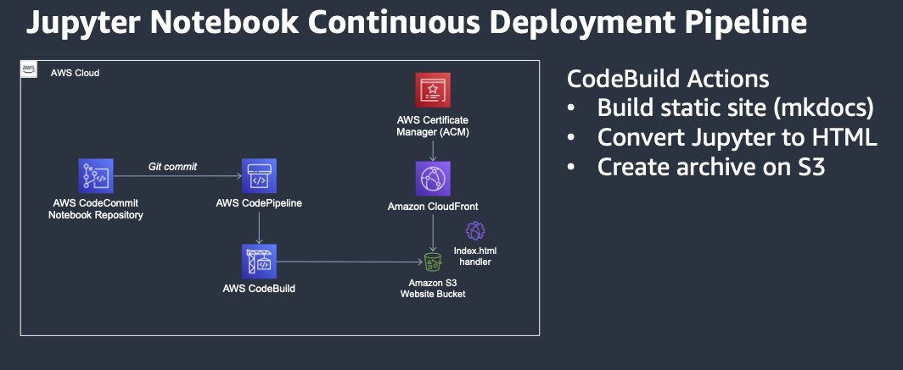
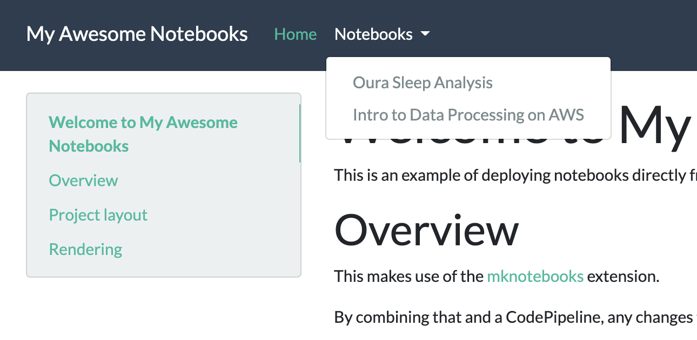

This is a guide on how to use AWS CodePipeline to continuously deploy Jupyter notebooks to an S3-backed static website.

## Overview

Since I started using [EMR Studio](https://aws.amazon.com/emr/features/studio/), I've been making more use of Jupyter notebooks as scratch pads and often want to be able to easily share the results of my research. I hunted around for a few different solutions and while there are some good ones like [nbconvert](https://nbconvert.readthedocs.io/en/latest/) and [jupytext](https://github.com/mwouts/jupytext/), I wanted something a bit simpler and off-the-shelf. This post from [Mikkel Hartmann](https://www.linkedin.com/in/mikkelhartmann/) about [making a static website from Jupyter Notebooks](http://mikkelhartmann.dk/2019/05/14/static-website-from-jupyter-notebooks.html) led me to [MkDocs](https://www.mkdocs.org/) and luckily, I came across [mknotebooks](https://github.com/greenape/mknotebooks), which offers a simple plugin for MkDocs. 😅

So, by using a simple static site generator that's geared toward project documentation, and a plugin that renders Jupyter notebooks quite well, and a few fancy code pipelines...I can easily push my notebooks to production. Let's go!

## Architecture

This is the architecture we'll be implementing. This will all be built using the [AWS Cloud Development Kit](https://aws.amazon.com/cdk/) (CDK).



We'll be creating the following:

- 2 S3 buckets to store our logs and website artifacts
- A CodeCommmit repository that holds our site and notebooks
- A CodeBuild project that generates the static site
- A CodePipeline that is triggered by new commits, builds the site, and deploys it to S3
- A CloudFront Distribution that serves the site
- And optionally an ACM certificate if you want an alternate domain name

I won't go into the details of the entire CDK stack, but instead will show how to deploy the CD pipeline.

## Deploying

### Pre-requisites

You'll need to have [CDK installed](https://docs.aws.amazon.com/cdk/latest/guide/getting_started.html#getting_started_prerequisites) (>= v1.107.0) and Python >= 3.9.

I use [nodenv](https://github.com/nodenv/nodenv) and [virtualenv](https://virtualenv.pypa.io/en/latest/) for my respective environments.

```shell
# I use node 14.5.0
nodenv shell 14.5.0

# And Python3
virtualenv -p python3.8 .venv
source .venv/bin/activate
```

### Bootstrapping

The source code is available in [dacort/jupyter-static-website](https://github.com/dacort/jupyter-static-website). In order to get started, we just need to clone that repo and deploy our CDK stack!

This project is a two-phased deploy due to the fact that CloudFront certificates need to be in `us-east-1`. If you _do not_ need a custom domain, you can skip the first part.

First, clone the project and install the necessary requirements.

```shell
git clone https://github.com/dacort/jupyter-static-website.git
cd jupyter-static-website
pip install -r requirements.txt
```

You'll also need to [bootstrap](https://docs.aws.amazon.com/cdk/latest/guide/bootstrapping.html) your AWS CDK environment in the account and region you want to deploy Part 2 in.

```shell
cdk bootstrap aws://ACCOUNT-NUMBER-1/REGION-1
```

### Part 1 - CloudFront Certificate

_If you are not using a custom domain, skip to Part 2_

This project only supports using the default CloudFront certificate and a DNS-validated CNAME. In order to generate the certificate, you'll need to run the command below, go into the [AWS Certificate Manager console](https://console.aws.amazon.com/acm/home?region=us-east-1#/) and make sure you follow the validation instructions.

```shell
cdk deploy CloudfrontCertificateStack -c domain_name=notebooks.example.com
```

Once the domain is validated, the stack should finish provisioning. 

One of the outputs from this stack will be `CloudfrontCertificateStack.certificatearn` - you'll need the value of this for the next phase.

### Part 2 - Jupyter CD Pipeline

_If you are not using a custom domain, you can omit both of the `-c` options below._

If you want to deploy to a different region, make sure you set the `AWS_DEFAULT_REGION` environment variable.


```shell
cdk deploy EmrStudioPublisherStack \
    -c domain_name=notebooks.example.com \
    -c certificate_arn=arn:aws:acm:us-east-1:012345678912:certificate/f07b01a4-3e8c-4639-8a22-b7a20a832de3
```

Once this stack finishes, you should have a CodeCommit repository you can make changes to, a CloudFront distribution, and a publicly accessible URL (found in the `EmrStudioPublisherStack.cloudfrontendpoint` output) that has a pre-populated example site.

The site will take a few minutes to deploy - you'll be able to keep an eye on the status in the [CodePipeline console](https://console.aws.amazon.com/codesuite/codepipeline/pipelines).

## Usage

Usage is pretty straight-forward. `git clone` the repository, add a new notebook, and push it back up! If you're using EMR Studio, you can add your CodeCommit repository and make your changes to your Jupyter notebooks there.

I made a video about [connecting to Git in EMR Studio](https://www.youtube.com/watch?v=ZdbUTxBjBIs) that you might find useful.

Any new notebooks added in the `site/docs/notebooks/` directory will automatically be published.

You can add links to the notebooks by updating the `nav` section of the `mkdocs.yml` file. 

```yaml
nav:
  - Home: index.md
  - Notebooks:
    - Oura Sleep Analysis: notebooks/damons_sleep.ipynb
    - Intro to Data Processing on AWS: notebooks/intro_data_processing_aws.ipynb
```

This YAML config will generate a nav dropdown like so.



### Advanced Usage

Note that not _all_ images or libraries render nicely when converting to HTML. This is why, for example, in my plotly example I had to use `fig.show(renderer="jupyterlab")`

In addition, if you paste multiple images into your notebook's Markdown, mknotebooks [only renders one of them](https://github.com/greenape/mknotebooks/issues/466). In order to work around this, I added a pre-build step that uniquify's all the image attachments in Markdown cells.