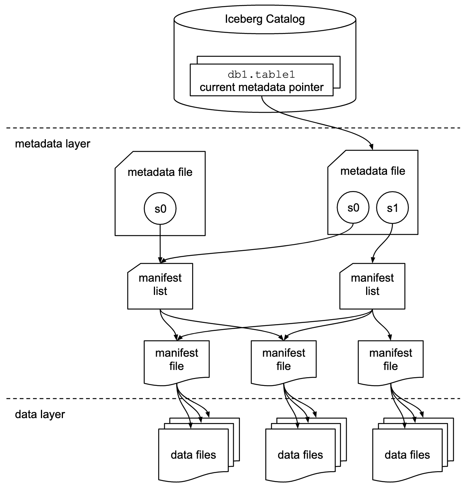

In recent years we've seen a rise in new storage layers for data lakes. In 2017, [Uber announced Hudi](https://eng.uber.com/hoodie/) - an incremental processing framework for data pipelines. In 2018, [Netflix introduced Iceberg](https://conferences.oreilly.com/strata/strata-ny-2018/public/schedule/detail/69503.html) - a new table format for managing extremely large cloud datasets. And in 2019, [Databricks open-sourced Delta Lake](https://techcrunch.com/2019/04/24/databricks-open-sources-delta-lake-to-make-data-lakes-more-reliable/) - originally intended to bring ACID transactions to data lakes.

> 📹 _If you'd like to watch a video that discusses the content of this post, I've also recorded [an overview here](https://www.youtube.com/watch?v=fryfx0Zg7KA). Each relevant section below will also link to individual timestamps._

This post aims to introduce each of these engines and give some insight into how they function under the hood and some of the differences in each. While I'll summarize the findings here, you can also view my Jupyter notebooks for each in my [modern-data-lake-storage-layers](https://github.com/dacort/modern-data-lake-storage-layers/tree/main/notebooks) repository. We begin with basic operations of writing and updating datasets.

One thing to note about all of these frameworks is that each began with a different challenge they were solving for, but over time they have begun to converge on a common set of functionality.

## Apache Hudi

> 📹 [Intro to Apache Hudi video](https://www.youtube.com/watch?v=fryfx0Zg7KA&t=323s)

Apache Hudi (Hadoop Upsert Delete and Incremental) was originally designed as an incremental stream processing framework and was built to combine the benefits of stream and batch processing. Hudi can be used with Spark, Flink, Presto, Trino and Hive, but much of the original work was focused around Spark and that's what I use for these examples.

For Hudi, we create a simple Spark DataFrame partitioned by `creation_date` and write that to S3.

```python
# Create a DataFrame
inputDF = spark.createDataFrame(
    [
        ("100", "2015-01-01", "2015-01-01T13:51:39.340396Z"),
        ("101", "2015-01-01", "2015-01-01T12:14:58.597216Z"),
        ("102", "2015-01-01", "2015-01-01T13:51:40.417052Z"),
        ("103", "2015-01-01", "2015-01-01T13:51:40.519832Z"),
        ("104", "2015-01-02", "2015-01-01T12:15:00.512679Z"),
        ("105", "2015-01-02", "2015-01-01T13:51:42.248818Z"),
    ],
    ["id", "creation_date", "last_update_time"],
)

# Specify common DataSourceWriteOptions in the single hudiOptions variable
hudiOptions = {
    "hoodie.table.name": "my_hudi_table",
    "hoodie.datasource.write.recordkey.field": "id",
    "hoodie.datasource.write.partitionpath.field": "creation_date",
    "hoodie.datasource.write.precombine.field": "last_update_time",
    "hoodie.datasource.hive_sync.enable": "true",
    "hoodie.datasource.hive_sync.table": "my_hudi_table",
    "hoodie.datasource.hive_sync.partition_fields": "creation_date",
    "hoodie.datasource.hive_sync.partition_extractor_class": "org.apache.hudi.hive.MultiPartKeysValueExtractor",
    "hoodie.index.type": "GLOBAL_BLOOM",  # This is required if we want to ensure we upsert a record, even if the partition changes
    "hoodie.bloom.index.update.partition.path": "true",  # This is required to write the data into the new partition (defaults to false in 0.8.0, true in 0.9.0)
}

# Write a DataFrame as a Hudi dataset
inputDF.write.format("org.apache.hudi").option(
    "hoodie.datasource.write.operation", "insert"
).options(**hudiOptions).mode("overwrite").save(f"s3://{S3_BUCKET_NAME}/tmp/hudi/")
```

When we look at the file structure on S3, we see a few things:

1. A `hoodie.properties` file

```
2022-01-14 00:33:46        503 tmp/hudi/.hoodie/hoodie.properties
```

This file contains certain metadata about the Hudi dataset:

```ini
#Properties saved on Fri Jan 14 00:33:45 UTC 2022
#Fri Jan 14 00:33:45 UTC 2022
hoodie.table.precombine.field=last_update_time
hoodie.table.partition.fields=creation_date
hoodie.table.type=COPY_ON_WRITE
hoodie.archivelog.folder=archived
hoodie.populate.meta.fields=true
hoodie.timeline.layout.version=1
hoodie.table.version=2
hoodie.table.recordkey.fields=id
hoodie.table.base.file.format=PARQUET
hoodie.table.keygenerator.class=org.apache.hudi.keygen.SimpleKeyGenerator
hoodie.table.name=my_hudi_table
```

2. A set of commit-related files

```plain
2022-01-14 00:33:57       2706 tmp/hudi/.hoodie/20220114003341.commit
2022-01-14 00:33:48          0 tmp/hudi/.hoodie/20220114003341.commit.requested
2022-01-14 00:33:52       1842 tmp/hudi/.hoodie/20220114003341.inflight
```

3. The actual `.parquet` data files and associated metadata organized into date-based partitions.

```plain
2022-01-14 00:33:54         93 tmp/hudi/2015-01-01/.hoodie_partition_metadata
2022-01-14 00:33:54     434974 tmp/hudi/2015-01-01/57f66198-5303-4922-9323-91737ec40d25-0_0-4-98_20220114003341.parquet
2022-01-14 00:33:55         93 tmp/hudi/2015-01-02/.hoodie_partition_metadata
2022-01-14 00:33:55     434943 tmp/hudi/2015-01-02/43051d12-87e7-4dfb-8201-6ce293cf0df7-0_1-6-99_20220114003341.parquet
```

We then update the `creation_date` of one row in this dataset. 

```python
from pyspark.sql.functions import lit

# Create a new DataFrame from the first row of inputDF with a different creation_date value
updateDF = inputDF.where("id = 100").withColumn("creation_date", lit("2022-01-11"))

updateDF.show()

# Update by using the "upsert" operation
updateDF.write.format("org.apache.hudi").option(
    "hoodie.datasource.write.operation", "upsert"
).options(**hudiOptions).mode("append").save(f"s3://{S3_BUCKET_NAME}/tmp/hudi/")
```

One thing to note here is that since we're updating a partition value (**DANGER!**), we had to set the `hoodie.index.type` to `GLOBAL_BLOOM` as well as setting `hoodie.bloom.index.update.partition.path` to `true`. This can have a large impact on performance so normally we would try not to change a partition value in a production environment, but it's useful here to see the impact it has. You can mind more details in the Hudi FAQ about [Hudi indexing](https://hudi.apache.org/learn/faq/#how-does-the-hudi-indexing-work--what-are-its-benefits).

After this write, we have a new set of commit-related files on S3:

```plain
2022-01-14 00:34:15       2706 tmp/hudi/.hoodie/20220114003401.commit
2022-01-14 00:34:03          0 tmp/hudi/.hoodie/20220114003401.commit.requested
2022-01-14 00:34:08       2560 tmp/hudi/.hoodie/20220114003401.inflight
```

And we actually have **2** new `.parquet` files:

```plain
2022-01-14 00:34:12     434925 tmp/hudi/2015-01-01/57f66198-5303-4922-9323-91737ec40d25-0_0-37-13680_20220114003401.parquet
...
2022-01-14 00:34:13         93 tmp/hudi/2022-01-11/.hoodie_partition_metadata
2022-01-14 00:34:14     434979 tmp/hudi/2022-01-11/0c210872-484e-428b-a9ca-90a26e42125c-0_1-43-13681_20220114003401.parquet
```

So what happened with the update is that the old partition (`2015-01-01`) had its data overwritten and the new partition (`2022-01-11`) *also* had data written to it. You can now see why the global bloom index could have such a large impact on write performance as there is significant potential for write amplication.

If we query the data and add the source filename for each row, we can also see that data for the old partition now comes from the new parquet file (notice the commit ID `20220114003401` shows up in the filename):

```python
from  pyspark.sql.functions import input_file_name

snapshotQueryDF = spark.read \
    .format('org.apache.hudi') \
    .load(f"s3://{S3_BUCKET_NAME}/tmp/hudi/") \
    .select('id', 'creation_date') \
    .withColumn("filename", input_file_name())
    
snapshotQueryDF.show(truncate=False)
```

```plain
+---+-------------+------------------------------------------------------------------------------------------------------------------------------+
|id |creation_date|filename                                                                                                                      |
+---+-------------+------------------------------------------------------------------------------------------------------------------------------+
|100|2022-01-11   |/hudi/2022-01-11/0c210872-484e-428b-a9ca-90a26e42125c-0_1-43-13681_20220114003401.parquet                                     |
|105|2015-01-02   |/hudi/2015-01-02/43051d12-87e7-4dfb-8201-6ce293cf0df7-0_1-6-99_20220114003341.parquet                                         |
|104|2015-01-02   |/hudi/2015-01-02/43051d12-87e7-4dfb-8201-6ce293cf0df7-0_1-6-99_20220114003341.parquet                                         |
|102|2015-01-01   |/hudi/2015-01-01/57f66198-5303-4922-9323-91737ec40d25-0_0-37-13680_20220114003401.parquet                                     |
|103|2015-01-01   |/hudi/2015-01-01/57f66198-5303-4922-9323-91737ec40d25-0_0-37-13680_20220114003401.parquet                                     |
|101|2015-01-01   |/hudi/2015-01-01/57f66198-5303-4922-9323-91737ec40d25-0_0-37-13680_20220114003401.parquet                                     |
+---+-------------+------------------------------------------------------------------------------------------------------------------------------+
```

One other thing to note is that Hudi adds quite a bit of metadata to your Parquet files. If we use native Spark to read one of the Parquet files and show it, we see that there's various `_hoodie`-prefixed keys.

```python
from pyspark.sql.functions import split

rawDF = (
    spark.read.parquet(f"s3://{S3_BUCKET_NAME}/tmp/hudi/*/*.parquet")
    .withColumn("filename", split(input_file_name(), "tmp/hudi").getItem(1))
    .sort("_hoodie_commit_time", "_hoodie_commit_seqno")
)
rawDF.show(truncate=False)
```

```plain
+-------------------+--------------------+------------------+----------------------+------------------------------------------------------------------------+---+-------------+---------------------------+------------------------------------------------------------------------------------+
|_hoodie_commit_time|_hoodie_commit_seqno|_hoodie_record_key|_hoodie_partition_path|_hoodie_file_name                                                       |id |creation_date|last_update_time           |filename                                                                            |
+-------------------+--------------------+------------------+----------------------+------------------------------------------------------------------------+---+-------------+---------------------------+------------------------------------------------------------------------------------+
|20220114003341     |20220114003341_0_1  |100               |2015-01-01            |57f66198-5303-4922-9323-91737ec40d25-0_0-4-98_20220114003341.parquet    |100|2015-01-01   |2015-01-01T13:51:39.340396Z|/2015-01-01/57f66198-5303-4922-9323-91737ec40d25-0_0-4-98_20220114003341.parquet    |
|20220114003341     |20220114003341_0_2  |102               |2015-01-01            |57f66198-5303-4922-9323-91737ec40d25-0_0-4-98_20220114003341.parquet    |102|2015-01-01   |2015-01-01T13:51:40.417052Z|/2015-01-01/57f66198-5303-4922-9323-91737ec40d25-0_0-37-13680_20220114003401.parquet|
|20220114003341     |20220114003341_0_2  |102               |2015-01-01            |57f66198-5303-4922-9323-91737ec40d25-0_0-4-98_20220114003341.parquet    |102|2015-01-01   |2015-01-01T13:51:40.417052Z|/2015-01-01/57f66198-5303-4922-9323-91737ec40d25-0_0-4-98_20220114003341.parquet    |
|20220114003341     |20220114003341_0_3  |103               |2015-01-01            |57f66198-5303-4922-9323-91737ec40d25-0_0-4-98_20220114003341.parquet    |103|2015-01-01   |2015-01-01T13:51:40.519832Z|/2015-01-01/57f66198-5303-4922-9323-91737ec40d25-0_0-37-13680_20220114003401.parquet|
|20220114003341     |20220114003341_0_3  |103               |2015-01-01            |57f66198-5303-4922-9323-91737ec40d25-0_0-4-98_20220114003341.parquet    |103|2015-01-01   |2015-01-01T13:51:40.519832Z|/2015-01-01/57f66198-5303-4922-9323-91737ec40d25-0_0-4-98_20220114003341.parquet    |
|20220114003341     |20220114003341_0_4  |101               |2015-01-01            |57f66198-5303-4922-9323-91737ec40d25-0_0-4-98_20220114003341.parquet    |101|2015-01-01   |2015-01-01T12:14:58.597216Z|/2015-01-01/57f66198-5303-4922-9323-91737ec40d25-0_0-37-13680_20220114003401.parquet|
|20220114003341     |20220114003341_0_4  |101               |2015-01-01            |57f66198-5303-4922-9323-91737ec40d25-0_0-4-98_20220114003341.parquet    |101|2015-01-01   |2015-01-01T12:14:58.597216Z|/2015-01-01/57f66198-5303-4922-9323-91737ec40d25-0_0-4-98_20220114003341.parquet    |
|20220114003341     |20220114003341_1_5  |105               |2015-01-02            |43051d12-87e7-4dfb-8201-6ce293cf0df7-0_1-6-99_20220114003341.parquet    |105|2015-01-02   |2015-01-01T13:51:42.248818Z|/2015-01-02/43051d12-87e7-4dfb-8201-6ce293cf0df7-0_1-6-99_20220114003341.parquet    |
|20220114003341     |20220114003341_1_6  |104               |2015-01-02            |43051d12-87e7-4dfb-8201-6ce293cf0df7-0_1-6-99_20220114003341.parquet    |104|2015-01-02   |2015-01-01T12:15:00.512679Z|/2015-01-02/43051d12-87e7-4dfb-8201-6ce293cf0df7-0_1-6-99_20220114003341.parquet    |
|20220114003401     |20220114003401_1_1  |100               |2022-01-11            |0c210872-484e-428b-a9ca-90a26e42125c-0_1-43-13681_20220114003401.parquet|100|2022-01-11   |2015-01-01T13:51:39.340396Z|/2022-01-11/0c210872-484e-428b-a9ca-90a26e42125c-0_1-43-13681_20220114003401.parquet|
+-------------------+--------------------+------------------+----------------------+------------------------------------------------------------------------+---+-------------+---------------------------+------------------------------------------------------------------------------------+
```

In the background, Hudi figures out which commits and values to show based on the commit files and metadata in the parquet files.

## Apache Iceberg

> 📹 [Intro to Apache Iceberg video](https://www.youtube.com/watch?v=fryfx0Zg7KA&t=1039s)

When I first heard about Iceberg, the phrase "table format for storing large, slow-moving tabular data" didn't really make sense to me. But after working with data lakes at scale, it became quite clear. Apache Hive is a popular data warehouse project that provides a SQL-like interface to large datasets. Built on top of Hadoop, it originally used HDFS as its data store. With cloud migrations, object stores like Amazon S3 enabled the ability to store even more data particularly without the operational concerns of a large Hadoop cluster, but with some limitations when compared to HDFS. Specifically, directory listings are slower (simple physics here, network calls are slower), renames are not atomic (by design), and results were previously eventually consistent.

So imagine you are Netflix, you have [hundreds of petabytes of data](https://netflixtechblog.com/optimizing-data-warehouse-storage-7b94a48fdcbe) stored on S3, and you need a way for your organization to efficiently query this. You need a data storage layer that reduces or removes directory listings, you want atomic changes, and you want to ensure that when you're reading your data you get consistent results. _There is more to Iceberg, but I'm simplifying because this helped me understand. :)_

These were some of the original goals for Iceberg, so let's dive in and see how it works. Similar to Hudi, we'll create a simple Spark DataFrame and write that to S3 in Iceberg format.

I should note that much of Iceberg is focused around Spark SQL, so I will switch to that below for certain operations.

```python
# Create a DataFrame
inputDF = spark.createDataFrame(
    [
        ("100", "2015-01-01", "2015-01-01T13:51:39.340396Z"),
        ("101", "2015-01-01", "2015-01-01T12:14:58.597216Z"),
        ("102", "2015-01-01", "2015-01-01T13:51:40.417052Z"),
        ("103", "2015-01-01", "2015-01-01T13:51:40.519832Z"),
        ("104", "2015-01-02", "2015-01-01T12:15:00.512679Z"),
        ("105", "2015-01-02", "2015-01-01T13:51:42.248818Z"),
    ],
    ["id", "creation_date", "last_update_time"],
)

# Write a DataFrame as an Iceberg dataset
inputDF.write.format("iceberg").mode("overwrite").partitionBy("creation_date").option(
    "path", f"s3://{S3_BUCKET_NAME}/tmp/iceberg/"
).saveAsTable(ICEBERG_TABLE_NAME)
```

There are two main differences here - there is not as much "configuration" as we had to do with Hudi and we also explicitly use `saveAsTable`. With Iceberg, much of the metadata is stored in a data catalog so creating the table is necessary. Let's see what happened on S3.

1. First, we have a `metadata.json` file

```plain
2022-01-28 06:03:50       2457 tmp/iceberg/metadata/00000-bb1d38a9-af77-42c4-a7b7-69416fe36d9c.metadata.json
```

2. Then a snapshot **manifest list** file

```plain
2022-01-28 06:03:50       3785 tmp/iceberg/metadata/snap-7934053180928033536-1-e79c79ba-c7f0-45ad-8f2e-fd1bc349db55.avro
```

3. And a manifest file

```plain
2022-01-28 06:03:50       6244 tmp/iceberg/metadata/e79c79ba-c7f0-45ad-8f2e-fd1bc349db55-m0.avro
```

4. And finally, we've got our Parquet data files

```plain
2022-01-28 06:03:49       1197 tmp/iceberg/data/creation_date=2015-01-01/00000-4-fa9a18fd-abc4-4e04-91b4-e2ac4c9531be-00001.parquet
2022-01-28 06:03:49       1171 tmp/iceberg/data/creation_date=2015-01-01/00001-5-eab30115-a1d6-4918-abb4-a198ac12b262-00001.parquet
2022-01-28 06:03:50       1182 tmp/iceberg/data/creation_date=2015-01-02/00001-5-eab30115-a1d6-4918-abb4-a198ac12b262-00002.parquet
```

There are a lot of moving pieces here, but the image from the Iceberg spec illustrates it quite well.



Similar to Hudi, our data is written to Parquet files in each partition, although Hive-style partitioning is used by default. Hudi can also do this by setting the [`hoodie.datasource.write.hive_style_partitioning
`](https://hudi.apache.org/docs/configurations/#hoodiedatasourcewritehive_style_partitioning) parameter.

Different from Hudi, though, is the usage of the data catalog to identify the current metadata file to use. That metadata file contains references to a list of manifest files to use to determine which data files compose the dataset for that particular version, also known as snapshots. The snapshot data also has quite a bit of additional informaiton. Let's update our dataset then take a look at S3 again and the snapshot portion of the metadata file.

```python
spark.sql(f"UPDATE {ICEBERG_TABLE_NAME} SET creation_date = '2022-01-11' WHERE id = 100")
```

We can see that we have:

- 2 new .parquet data files

```plain
2022-01-28 06:07:07       1180 tmp/iceberg/data/creation_date=2015-01-01/00000-16-033354bd-7b02-44f4-95e2-7045e10706fc-00001.parquet
2022-01-28 06:07:08       1171 tmp/iceberg/data/creation_date=2022-01-11/00000-16-033354bd-7b02-44f4-95e2-7045e10706fc-00002.parquet
```

As well as:
- 1 new metadata.json file
- 2 new .avro metadata listings
- 1 new snap-*.avro snapshot file

Let's look at the snapshot portion of the `metadata.json` file.

```json
"snapshots": [
    {
        "manifest-list": "s3://<BUCKET>/tmp/iceberg/metadata/snap-7934053180928033536-1-e79c79ba-c7f0-45ad-8f2e-fd1bc349db55.avro",
        "schema-id": 0,
        "snapshot-id": 7934053180928033536,
        "summary": {
            "added-data-files": "3",
            "added-files-size": "3550",
            "added-records": "6",
            "changed-partition-count": "2",
            "operation": "append",
            "spark.app.id": "application_1643153254969_0029",
            "total-data-files": "3",
            "total-delete-files": "0",
            "total-equality-deletes": "0",
            "total-files-size": "3550",
            "total-position-deletes": "0",
            "total-records": "6"
        },
        "timestamp-ms": 1643349829278
    },
    {
        "manifest-list": "s3://<BUCKET>/tmp/iceberg/metadata/snap-5441092870212826638-1-605de48f-8ccf-450c-935e-bbd4194ee8cc.avro",
        "parent-snapshot-id": 7934053180928033536,
        "schema-id": 0,
        "snapshot-id": 5441092870212826638,
        "summary": {
            "added-data-files": "2",
            "added-files-size": "2351",
            "added-records": "3",
            "changed-partition-count": "2",
            "deleted-data-files": "1",
            "deleted-records": "3",
            "operation": "overwrite",
            "removed-files-size": "1197",
            "spark.app.id": "application_1643153254969_0029",
            "total-data-files": "4",
            "total-delete-files": "0",
            "total-equality-deletes": "0",
            "total-files-size": "4704",
            "total-position-deletes": "0",
            "total-records": "6"
        },
        "timestamp-ms": 1643350027635
    }
]
```

This is pretty amazing - we see how many files **and records** were added or deleted, what the file sizes were, and even what the Spark `app_id` was! 🤯 Some of this data is in the `manifest-list` files as well, but you can begin to see *just* how much you could potentially optimize your queries using this data. 

## Delta Lake

> 📹 [Intro to Delta Lake video](https://www.youtube.com/watch?v=fryfx0Zg7KA&t=1814s)

Delta Lake was also introduced by Databricks as a way to address many of the challenges of Data Lakes. Similar to Hudi and Iceberg its goals include unifying batch and stream processing, ACID transactions, and scalable metadata handling among others.

Again, we'll create a simple Spark DataFrame and write it to S3 in Delta format.

```python
# Create a DataFrame
inputDF = spark.createDataFrame(
    [
        ("100", "2015-01-01", "2015-01-01T13:51:39.340396Z"),
        ("101", "2015-01-01", "2015-01-01T12:14:58.597216Z"),
        ("102", "2015-01-01", "2015-01-01T13:51:40.417052Z"),
        ("103", "2015-01-01", "2015-01-01T13:51:40.519832Z"),
        ("104", "2015-01-02", "2015-01-01T12:15:00.512679Z"),
        ("105", "2015-01-02", "2015-01-01T13:51:42.248818Z"),
    ],
    ["id", "creation_date", "last_update_time"],
)

# Write a DataFrame as a Delta dataset
inputDF.write.format("delta").mode("overwrite").option(
    "overwriteSchema", "true"
).partitionBy("creation_date").save(f"s3://{S3_BUCKET_NAME}/tmp/delta/")
```

On S3, we now see the following files:

1. a `00000000000000000000.json` file

```plain
2022-01-24 22:57:54       2120 tmp/delta/_delta_log/00000000000000000000.json
```

2. Several `.snappy.parquet` files

```plain
2022-01-24 22:57:52        875 tmp/delta/creation_date=2015-01-01/part-00005-2e09dbe4-469e-40dc-9b36-833480f6d375.c000.snappy.parquet
2022-01-24 22:57:52        875 tmp/delta/creation_date=2015-01-01/part-00010-848c69e1-71fb-4f8f-a19a-dd74e0ef1b8a.c000.snappy.parquet
2022-01-24 22:57:53        875 tmp/delta/creation_date=2015-01-01/part-00015-937d1837-0f03-4306-9b4e-4366207e688d.c000.snappy.parquet
2022-01-24 22:57:54        875 tmp/delta/creation_date=2015-01-01/part-00021-978a808e-4c36-4646-b7b1-ef5a21e706d8.c000.snappy.parquet
2022-01-24 22:57:54        875 tmp/delta/creation_date=2015-01-02/part-00026-538e1ac6-055e-4e72-9177-63daaaae1f98.c000.snappy.parquet
2022-01-24 22:57:52        875 tmp/delta/creation_date=2015-01-02/part-00031-8a03451a-0297-4c43-b64d-56db25807d02.c000.snappy.parquet
```

OK, so what's in that `_delta_log` file? Similar to Iceberg, quite a bit of information about this initial write to S3 including the number of files written, the schema of the dataset, and even the individual `add` operations for each file.

```json
{
  "commitInfo": {
    "timestamp": 1643065073634,
    "operation": "WRITE",
    "operationParameters": {
      "mode": "Overwrite",
      "partitionBy": "[\"creation_date\"]"
    },
    "isBlindAppend": false,
    "operationMetrics": {
      "numFiles": "6",
      "numOutputBytes": "5250",
      "numOutputRows": "6"
    }
  }
}
{
  "protocol": {
    "minReaderVersion": 1,
    "minWriterVersion": 2
  }
}
{
  "metaData": {
    "id": "a7f4b1d1-09f6-4475-894a-0eec90d1aab5",
    "format": {
      "provider": "parquet",
      "options": {}
    },
    "schemaString": "{\"type\":\"struct\",\"fields\":[{\"name\":\"id\",\"type\":\"string\",\"nullable\":true,\"metadata\":{}},{\"name\":\"creation_date\",\"type\":\"string\",\"nullable\":true,\"metadata\":{}},{\"name\":\"last_update_time\",\"type\":\"string\",\"nullable\":true,\"metadata\":{}}]}",
    "partitionColumns": [
      "creation_date"
    ],
    "configuration": {},
    "createdTime": 1643065064066
  }
}
{
  "add": {
    "path": "creation_date=2015-01-01/part-00005-2e09dbe4-469e-40dc-9b36-833480f6d375.c000.snappy.parquet",
    "partitionValues": {
      "creation_date": "2015-01-01"
    },
    "size": 875,
    "modificationTime": 1643065072000,
    "dataChange": true
  }
}
{
  "add": {
    "path": "creation_date=2015-01-01/part-00010-848c69e1-71fb-4f8f-a19a-dd74e0ef1b8a.c000.snappy.parquet",
    "partitionValues": {
      "creation_date": "2015-01-01"
    },
    "size": 875,
    "modificationTime": 1643065072000,
    "dataChange": true
  }
}
{
  "add": {
    "path": "creation_date=2015-01-01/part-00015-937d1837-0f03-4306-9b4e-4366207e688d.c000.snappy.parquet",
    "partitionValues": {
      "creation_date": "2015-01-01"
    },
    "size": 875,
    "modificationTime": 1643065073000,
    "dataChange": true
  }
}
{
  "add": {
    "path": "creation_date=2015-01-01/part-00021-978a808e-4c36-4646-b7b1-ef5a21e706d8.c000.snappy.parquet",
    "partitionValues": {
      "creation_date": "2015-01-01"
    },
    "size": 875,
    "modificationTime": 1643065074000,
    "dataChange": true
  }
}
{
  "add": {
    "path": "creation_date=2015-01-02/part-00026-538e1ac6-055e-4e72-9177-63daaaae1f98.c000.snappy.parquet",
    "partitionValues": {
      "creation_date": "2015-01-02"
    },
    "size": 875,
    "modificationTime": 1643065074000,
    "dataChange": true
  }
}
{
  "add": {
    "path": "creation_date=2015-01-02/part-00031-8a03451a-0297-4c43-b64d-56db25807d02.c000.snappy.parquet",
    "partitionValues": {
      "creation_date": "2015-01-02"
    },
    "size": 875,
    "modificationTime": 1643065072000,
    "dataChange": true
  }
}
```

Alright, let's go ahead and update one of our rows. Delta Lake provides a merge operation that we can use. We'll use the syntax [from the docs](https://docs.delta.io/latest/quick-start.html#update-table-data) that's slightly different from native Spark as it creates a DeltaTable object.

```python
from pyspark.sql.functions import lit

# Create a new DataFrame from the first row of inputDF with a different creation_date value
updateDF = inputDF.where("id = 100").withColumn("creation_date", lit("2022-01-11"))

from delta.tables import *
from pyspark.sql.functions import *

deltaTable = DeltaTable.forPath(spark, f"s3://{S3_BUCKET_NAME}/tmp/delta/")

deltaTable.alias("oldData") \
  .merge(
    updateDF.alias("newData"),
    "oldData.id = newData.id") \
  .whenMatchedUpdate(set = { "creation_date": col("newData.creation_date") }) \
  .execute()
```

Interestingly, now when we look at S3 we see 1 new `json` file and only 1 new `parquet` file (Remember Hudi and Iceberg both had 2 new `parquet` files).

```plain
2022-01-24 23:05:46       1018 tmp/delta/_delta_log/00000000000000000001.json
2022-01-24 23:05:46        875 tmp/delta/creation_date=2022-01-11/part-00000-3f3fd83a-b876-4b6f-8f64-d8a4189392ae.c000.snappy.parquet
```

If we look at that new JSON file we see something really interesting:

```json
{
  "commitInfo": {
    "timestamp": 1643065545396,
    "operation": "MERGE",
    "operationParameters": {
      "predicate": "(oldData.`id` = newData.`id`)",
      "matchedPredicates": "[{\"actionType\":\"update\"}]",
      "notMatchedPredicates": "[]"
    },
    "readVersion": 0,
    "isBlindAppend": false,
    "operationMetrics": {
      "numTargetRowsCopied": "0",
      "numTargetRowsDeleted": "0",
      "numTargetFilesAdded": "1",
      "executionTimeMs": "4705",
      "numTargetRowsInserted": "0",
      "scanTimeMs": "3399",
      "numTargetRowsUpdated": "1",
      "numOutputRows": "1",
      "numSourceRows": "1",
      "numTargetFilesRemoved": "1",
      "rewriteTimeMs": "1265"
    }
  }
}
{
  "remove": {
    "path": "creation_date=2015-01-01/part-00005-2e09dbe4-469e-40dc-9b36-833480f6d375.c000.snappy.parquet",
    "deletionTimestamp": 1643065545378,
    "dataChange": true,
    "extendedFileMetadata": true,
    "partitionValues": {
      "creation_date": "2015-01-01"
    },
    "size": 875
  }
}
{
  "add": {
    "path": "creation_date=2022-01-11/part-00000-3f3fd83a-b876-4b6f-8f64-d8a4189392ae.c000.snappy.parquet",
    "partitionValues": {
      "creation_date": "2022-01-11"
    },
    "size": 875,
    "modificationTime": 1643065546000,
    "dataChange": true
  }
}
```

In addition to the `operationMetrics` that gives us insight into how the data changed on "disk", we also now see both a `remove` and `add` operation. In Delta Lake (and I'm not quite sure why this happened yet...), each row was written to an individual `.parquet` file! So for this second version of the data, the fact that that row was updated simply lives in the metadata because it was the only row stored in that Parquet file. I'm guessing this is simply because my dataset is so small the default number of partitions in Spark/Delta Lake resulted in this write configuration.

## Snapshots

So now we've got a good idea of the semantics of each of these storage layers. Let's take one more look at an important component of all of them and that's snapshots!

### Hudi

Hudi has a concept of "point-in-time" queries where you provide it a range of two commit timestamps and it will show you what the data looked like at that point in time.

```python
# Query data from the first version of the table
readOptions = {
  'hoodie.datasource.query.type': 'incremental',
  'hoodie.datasource.read.begin.instanttime': '0',
  'hoodie.datasource.read.end.instanttime': '20220114003341',
}

incQueryDF = spark.read \
    .format('org.apache.hudi') \
    .options(**readOptions) \
    .load(f"s3://{S3_BUCKET_NAME}/tmp/hudi")
    
incQueryDF.show()
```

### Iceberg

Iceberg supports a similar mechanism called time travel and you can use either a `snapshot-id` or `as-of-timestamp` similar to Hudi.

```python
# time travel to 2022-01-27 22:04:00 -0800
df = spark.read \
    .option("as-of-timestamp", "1643349840000") \
    .format("iceberg") \
    .load(ICEBERG_TABLE_NAME)
    
df.show()
```

### Delta Lake

And, of course, Delta Lake supports this as well using either [Spark SQL or DataFrames](https://docs.delta.io/latest/delta-batch.html#-deltatimetravel). And similar to Iceberg you can use `versionAsOf` or `timestampAsOf`.

```python
# time travel to 2022-01-24 23:00
df1 = (
    spark.read.format("delta")
    .option("timestampAsOf", "2022-01-24 23:00")
    .load(f"s3://{S3_BUCKET_NAME}/tmp/delta/")
)
```

## Deletes

I bet you're surprised I haven't mentioned deletes or GDPR yet. Don't worry...I will. 😀 But first I just wanted to understand exactly how these different systems work.

## Wrapup

In this post, we reviewed the basics of Apache Hudi, Apache Iceberg, and Delta Lake - modern data lake storage layers. All these frameworks enable a set of functionality that optimize working with data in cloud-based object stores, albeit with slightly different approaches. 