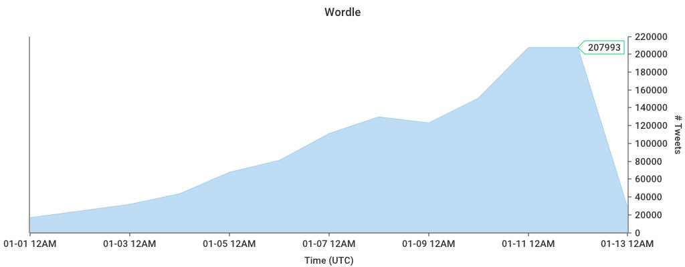
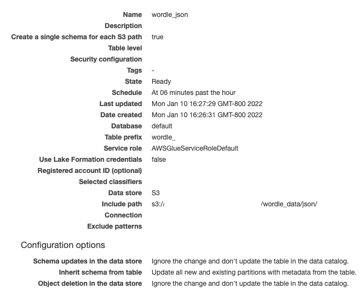
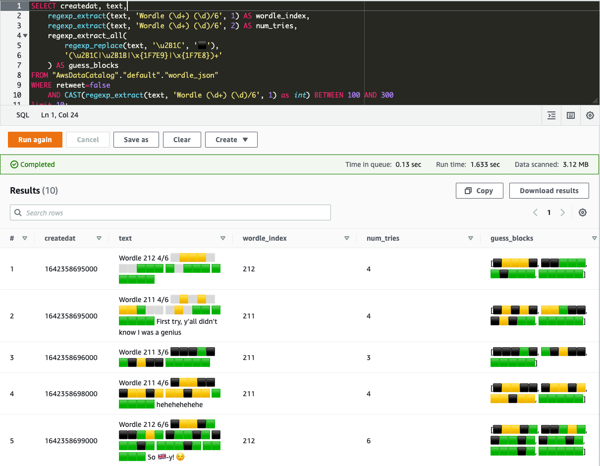

Like many, [I was recently](https://twitter.com/dacort/status/1466940658271199233?s=20&t=cEoyLkoJSazoAHW9XRhjvw) drawn in to a simple word game by the name of "Wordle". Also, like many I wanted to dive into the analytics of all the yellow, green, and white-or-black-depending-on-your-dark-mode blocks. While you can easily [query tweet volume](https://www.tweetstats.com/) using the Twitter API, I wanted to dig deeper. And the tweets were growing...



Given the recent announcement of [MSK Connect](https://aws.amazon.com/blogs/aws/introducing-amazon-msk-connect-stream-data-to-and-from-your-apache-kafka-clusters-using-managed-connectors/), I wanted to see if I could easily consume the Twitter Stream into S3 and query the data with Athena. So I looked around a bit and found this [kafka-connect-twitter](https://github.com/jcustenborder/kafka-connect-twitter) GitHub repo and this [great blog post from Confluent](https://www.confluent.io/blog/using-ksql-to-analyse-query-and-transform-data-in-kafka/) on analyzing Twitter data using that connector. So...off to the AWS console!

I'll walk through the steps of creating everything below, but I did create a CloudFormation template in my [serverless-twitter-analytics](https://github.com/dacort/serverless-twitter-analytics.git) repository that creates everything you need except for building the connector artifacts and creating the connectors in MSK.

## Setting up Amazon MSK

First we need an MSK cluster. (_I was hoping to use the MSK Serverless preview, but alas MSK Connect isn't supported with it._) This is pretty easy to do in the [MSK Console](https://console.aws.amazon.com/msk/home#/clusters) - just click the "Create cluster" button and use the "Quick create" option. 

ℹ️ **One very important thing to note here** – The cluster *must* be created with private subnets and the VPC should have a public subnet with a public NAT Gateway. You may need to use the "Custom create" option here if the default subnets aren't private.

I used the default Kafka version of 2.6.2 and left all other defaults.

## Setting up Amazon MSK Connect

We're going to use two connectors:
- One producer to stream data from the Twitter API into Kafka
- One consumer to read data from Kafka and write it out into partioned JSON files in S3

This was probably the trickiest part, for a couple reasons solely related to my environment and lack of experience with Kafka:
- The [kafka-connect-twitter](https://github.com/jcustenborder/kafka-connect-twitter) connector didn't want to compile locally
- I had to figure out the proper connector configuration to write the data to S3 in my desired JSON format

### Build the Twitter connector

To address #1, I used a [Dockerfile](https://github.com/dacort/serverless-twitter-analytics/blob/main/Dockerfile) to download/build the Twitter connector.

```docker
FROM openjdk:8 AS build-stage

RUN apt-get update && apt-get install -y \
    maven \
    zip

WORKDIR /usr/src/ktwit
ADD https://github.com/jcustenborder/kafka-connect-twitter/archive/refs/tags/0.3.34.tar.gz /usr/src/ktwit/

RUN tar xzf 0.3.34.tar.gz && \
    cd kafka-connect-twitter-0.3.34 && \
    mvn clean package

RUN tar xzf kafka-connect-twitter-0.3.34/target/kafka-connect-twitter-0.3-SNAPSHOT.tar.gz && \
    zip -rj kafka-connect-twitter-0.3.34.zip usr/share/kafka-connect/kafka-connect-twitter/

FROM scratch AS export-stage
COPY --from=build-stage /usr/src/ktwit/*.zip /
```

MSK plugins must be be a zip file, so the last steps in the Dockerfile also decompress the `.tar.gz` with the built jar and its dependencies and repackage them into a zip file. I use the following command to build and copy the zip file to my local filesystem.

```shell
docker build --output . .
```

You should have a `kafka-connect-twitter-0.3.34.zip` locally - go ahead and upload that to S3.

For the S3 connector, you can download a pre-built zip file from the [Confluent Amazon S3 Sink Connector](https://www.confluent.io/hub/confluentinc/kafka-connect-s3). Download that and upload it to S3 as well.

### Create the MSK Connect connectors

#### Twitter connector

First you create a custom plugin. Go to the "Custom plugins" section under "MSK Connect" and then just click the "Create custom plugin" button. Provide the path to your `kafka-connect-twitter-0.3.34.zip` file in S3 and you're done.

Next, in the Connectors section click "Create connector". Select "Use existing custom plugin" and select the plugin you just created. In the next section, give it a name (I chose `twitter-search-wordle`) and select the MSK cluster you created previously. For the Connector configuration, here's what I used below – you'll need to replace the `twitter.oauth` variables with your own credentials and set `filter.keywords` to the keywords you want to track.

This configuration will automatically create a `twitter_json` topic in your Kafka cluster.

```ini
connector.class=com.github.jcustenborder.kafka.connect.twitter.TwitterSourceConnector
tasks.max=1
twitter.http.connectionTimeout=120000
twitter.oauth.consumerKey=<TWITTER_CONSUMER_KEY>
twitter.oauth.consumerSecret=<TWITTER_CONSUMER_SECRET>
twitter.oauth.accessToken=<TWITTER_ACCESS_TOKEN>
twitter.oauth.accessTokenSecret=<TWITTER_ACCESS_TOKEN_SECRET>
twitter.debug=true
process.deletes=true
filter.keywords=wordle
kafka.status.topic=twitter_json
kafka.delete.topic=twitter_deletes_json_02
twitter.http.prettyDebug=true
topic.creation.enable=true
topic.creation.default.partitions=4
topic.creation.default.replication.factor=2
key.converter=org.apache.kafka.connect.json.JsonConverter
key.converter.schemas.enable=false
value.converter=org.apache.kafka.connect.json.JsonConverter
value.converter.schemas.enable=false
```

You'll also need to create an IAM service role for your connectors. You can find the cluster ARN in the console on your cluster summary page. I use the policy below for both my Twitter and S3 connectors.



```json
{
    "Version": "2012-10-17",
    "Statement": [
        {
            "Effect": "Allow",
            "Action": [
                "kafka-cluster:Connect",
                "kafka-cluster:DescribeCluster"
            ],
            "Resource": [
                "arn:aws:kafka:<region>:<account_id>:cluster/<cluster_name>/<cluster_uuid>"
            ]
        },
        {
            "Effect": "Allow",
            "Action": [
                "kafka-cluster:ReadData",
                "kafka-cluster:DescribeTopic"
            ],
            "Resource": [
                "arn:aws:kafka:<region>:<account_id>:cluster/<cluster_name>/<cluster_uuid>/*",
                "arn:aws:kafka:<region>:<account_id>:topic/<cluster_name>/<cluster_uuid>/*"
            ]
        },
        {
            "Effect": "Allow",
            "Action": [
                "kafka-cluster:WriteData",
                "kafka-cluster:DescribeTopic"
            ],
            "Resource": [
                "arn:aws:kafka:<region>:<account_id>:cluster/<cluster_name>/<cluster_uuid>/*",
                "arn:aws:kafka:<region>:<account_id>:topic/<cluster_name>/<cluster_uuid>/*"
            ]
        },
        {
            "Effect": "Allow",
            "Action": [
                "kafka-cluster:CreateTopic",
                "kafka-cluster:WriteData",
                "kafka-cluster:ReadData",
                "kafka-cluster:DescribeTopic"
            ],
            "Resource": [
                "arn:aws:kafka:<region>:<account_id>:topic/<cluster_name>/<cluster_uuid>/__amazon_msk_connect_*",
                "arn:aws:kafka:<region>:<account_id>:topic/<cluster_name>/<cluster_uuid>/*"
            ]
        },
        {
            "Effect": "Allow",
            "Action": [
                "kafka-cluster:AlterGroup",
                "kafka-cluster:DescribeGroup"
            ],
            "Resource": [
                "arn:aws:kafka:<region>:<account_id>:group/<cluster_name>/<cluster_uuid>/__amazon_msk_connect_*",
                "arn:aws:kafka:<region>:<account_id>:group/<cluster_name>/<cluster_uuid>/connect-*"
            ]
        },
        {
            "Effect": "Allow",
            "Action": [
                "s3:ListAllMyBuckets"
            ],
            "Resource": "arn:aws:s3:::*"
        },
        {
            "Effect": "Allow",
            "Action": [
                "s3:ListBucket",
                "s3:GetBucketLocation"
            ],
            "Resource": "arn:aws:s3:::s3-bucket-name"
        },
        {
            "Effect": "Allow",
            "Action": [
                "s3:PutObject",
                "s3:GetObject",
                "s3:AbortMultipartUpload",
                "s3:ListMultipartUploadParts",
                "s3:ListBucketMultipartUploads"
            ],
            "Resource": "arn:aws:s3:::s3-bucket-name/*"
        }
    ]
}
```



#### S3 connector

Now we create another custom plugin for S3 and then a connector using that plugin. All the options are the same as the above, but we provide this connector configuration. You'll need to update the `s3.region` and `s3.bucket.name` keys with your specific values.

By default, this configuration will output line-based JSON files partitioned by year-month-day-hour (`path.format`) and flush data to S3 every 1,000 records (`flush.size`). The `ByteArrayFormat` is used so the data gets written to S3 in raw JSON format (per [https://stackoverflow.com/q/68223215/5141922](https://stackoverflow.com/q/68223215/5141922)). Per the [Kafka Connect S3 docs](https://docs.confluent.io/kafka-connect-s3-sink/current/overview.html#s3-object-uploads), I also configured "scheduled rotation" on the sink so that data will be flushed to S3 on a regular basis.

```ini
connector.class=io.confluent.connect.s3.S3SinkConnector
s3.bucket.name=<S3_BUCKET_NAME>
s3.region=<S3_BUCKET_REGION>
flush.size=1000
format.bytearray.extension=.json
format.class=io.confluent.connect.s3.format.bytearray.ByteArrayFormat
locale=en-US
partition.duration.ms=600000
partitioner.class=io.confluent.connect.storage.partitioner.TimeBasedPartitioner
path.format='year'=YYYY/'month'=MM/'day'=dd/'hour'=HH
rotate.schedule.interval.ms=300000
s3.compression.type=gzip
schema.compatibility=NONE
storage.class=io.confluent.connect.s3.storage.S3Storage
tasks.max=2
timezone=UTC
topics.dir=wordle_data/json
topics=twitter_json_02,twitter_deletes_json_02
value.converter=org.apache.kafka.connect.converters.ByteArrayConverter
```

The tricky part here was figuring out the right combination of format classes and key/value converters. My initial attempts had Java Structs getting written out to S3 and then escaped JSON, but I finally found the right combination of `JsonConverter` for the producer and `ByteArrayFormat` for the consumer. I wanted JSON so I could easily consume the data in Athena!

## Setting up Amazon Athena

With the configuration above, you should now have gzip'ed JSON Twitter data streaming into your S3 bucket!

```shell
➜ aws s3 ls s3://${S3_BUCKET}/wordle_data/json/ --recursive | head
2022-01-10 16:23:33     346352 wordle_data/json/twitter_json/year=2022/month=01/day=11/hour=00/twitter_json+0+0000000000.json.gz
2022-01-10 16:23:34     346449 wordle_data/json/twitter_json/year=2022/month=01/day=11/hour=00/twitter_json+0+0000001000.json.gz
2022-01-10 16:23:35     329079 wordle_data/json/twitter_json/year=2022/month=01/day=11/hour=00/twitter_json+0+0000002000.json.gz
2022-01-10 16:25:01     163478 wordle_data/json/twitter_json/year=2022/month=01/day=11/hour=00/twitter_json+0+0000003000.json.gz
2022-01-10 16:30:01      58634 wordle_data/json/twitter_json/year=2022/month=01/day=11/hour=00/twitter_json+0+0000003505.json.gz
2022-01-10 16:35:01      55148 wordle_data/json/twitter_json/year=2022/month=01/day=11/hour=00/twitter_json+0+0000003681.json.gz
```

Next, we'll set up a [Glue Crawler](https://console.aws.amazon.com/glue/home#catalog:tab=crawlers) to create our data catalog table and keep the partitions up-to-date.

When creating the crawler, point it to the S3 bucket and prefix you configured above (`s3://<BUCKET_NAME>/wordle_data/json/`). I also configured it to "Crawl new folders only" and run at 6 minutes after the hour (`06 0/1 * * ? *`). Since I configured the S3 sink connector to rate files every 5 minute, this ensures that every run should pick up the new partition as quick as possible. Here's a screenshot of my final configuration:



You may want to run your crawler manually the first time, but once you do you should see a new table show up in your data catalog! And you should be able to immediately query the data in Athena! (_If you haven't setup Athena yet, you'll need to create a bucket for results._)

```sql
SELECT createdat, text,
    regexp_extract(text, 'Wordle (\d+) (\d)/6', 1) AS wordle_index,
    regexp_extract(text, 'Wordle (\d+) (\d)/6', 2) AS num_tries,
    regexp_extract_all(
        regexp_replace(text, '\u2B1C', '⬛'),
        '(\u2B1C|\u2B1B|\x{1F7E9}|\x{1F7E8})+'
    ) AS guess_blocks
FROM "AwsDataCatalog"."default"."wordle_json"
WHERE retweet=false
    AND CAST(regexp_extract(text, 'Wordle (\d+) (\d)/6', 1) as int) BETWEEN 100 AND 300
limit 10;
```



And that's it! Now you can query to your heart's content. :) _Note that `SELECT *` won't work due to some of the nested fields not being defined properly._