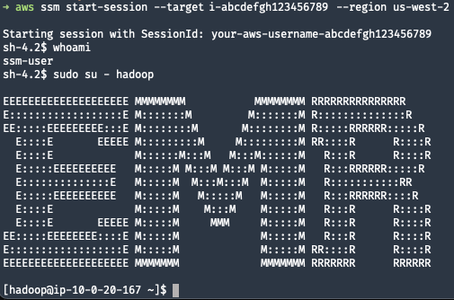
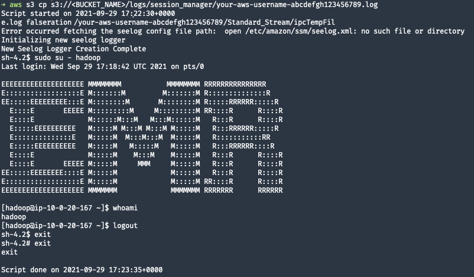

I'm kind of an old-school sys admin (aka, managed NT4 in the 90's) so I'm really used to SSH'ing into hosts. More often than not, however, I'm working with AWS EC2 instances in a private subnet.

If you're not familiar with it [AWS Systems Manager Session Manager](https://docs.aws.amazon.com/systems-manager/latest/userguide/session-manager.html) is a pretty sweet feature that allows you to connect remotely to EC2 instances with the AWS CLI, without needing to open up ports for SSH or utilize a bastion host.

I've been using it in my browser occasionally, which is pretty handy, but I wanted to use it from my terminal. It required a couple steps to get working.

## Set up Session Manager with AWS CLI

1. Install the [Session Manager plugin](https://docs.aws.amazon.com/systems-manager/latest/userguide/session-manager-working-with-install-plugin.html) for the AWS CLI

I'm on a mac, so I just installed the plugin with the signed installer

```shell
curl "https://s3.amazonaws.com/session-manager-downloads/plugin/latest/mac/session-manager-plugin.pkg" -o ~/Downloads/session-manager-plugin.pkg

sudo installer -pkg ~/Downloads/session-manager-plugin.pkg -target /
sudo ln -s /usr/local/sessionmanagerplugin/bin/session-manager-plugin /usr/local/bin/session-manager-plugin
```

```shell
➜ session-manager-plugin


The Session Manager plugin was installed successfully. Use the AWS CLI to start a session.
```

Sweet, good to go there!

2. Now use the AWS CLI to connect to an instance!

_You may need to specify the region your instance is in_

```shell
aws ssm start-session --target i-abcdefgh123456789 --region us-west-2
```

Awesome! You're good to go!



## Enable Logging

The other nice thing if your memory is as bad as mine (or you want auditing, which is a more legitimate reason), you can also enable logging of your sessions to S3 or CloudWatch. 

This is what the default config looks like:

```shell
aws ssm get-document \
    --region us-west-2 \
    --name "SSM-SessionManagerRunShell" \
    --document-version "\$LATEST" \
    | jq '.Content | fromjson'
```

```json
{
  "schemaVersion": "1.0",
  "description": "Document to hold regional settings for Session Manager",
  "sessionType": "Standard_Stream",
  "inputs": {
    "s3BucketName": "",
    "s3KeyPrefix": "",
    "s3EncryptionEnabled": true,
    "cloudWatchLogGroupName": "",
    "cloudWatchEncryptionEnabled": true,
    "cloudWatchStreamingEnabled": true,
    "idleSessionTimeout": "20",
    "kmsKeyId": "",
    "runAsEnabled": false,
    "runAsDefaultUser": "",
    "shellProfile": {
      "windows": "",
      "linux": ""
    }
  }
}
```

So we'll just update that to add in the S3 configuration.

1. Update Session Manager preferences

_Note that I **do not** enable encryption here._ This setting needs to match your bucket setting and you need to make sure your VPC has the proper endpoints and access to write to S3. Check [troubleshooting](https://docs.aws.amazon.com/systems-manager/latest/userguide/session-manager-troubleshooting.html#session-manager-troubleshooting-start-blank-screen) if you get a blank screen when trying to start a session.

```shell
BUCKET=<BUCKET_NAME>
PREFIX=logs/session_manager/

aws ssm update-document \
    --region us-west-2 \
    --name "SSM-SessionManagerRunShell" \
    --document-version "\$LATEST" \
    --content '{
  "schemaVersion": "1.0",
  "description": "Document to hold regional settings for Session Manager",
  "sessionType": "Standard_Stream",
  "inputs": {
    "s3BucketName": "'${BUCKET}'",
    "s3KeyPrefix": "'${PREFIX}'",
    "s3EncryptionEnabled": false,
    "cloudWatchLogGroupName": "",
    "cloudWatchEncryptionEnabled": true,
    "cloudWatchStreamingEnabled": true,
    "idleSessionTimeout": "20",
    "kmsKeyId": "",
    "runAsEnabled": false,
    "runAsDefaultUser": "",
    "shellProfile": {
      "windows": "",
      "linux": ""
    }
  }
}'
```

2. Create another session!

```shell
aws ssm start-session --target i-abcdefgh123456789 --region us-west-2
```

Once you're done with your session and exit, you should have a log file in your S3 bucket.

3. View logs

```shell
aws s3 ls s3://<BUCKET_NAME>/logs/session_manager/
```

```
2021-09-29 10:21:24       4177 your-aws-username-abcdefgh123456789.log
```

And that log file will have the full contents of your session.

```shell
aws s3 cp s3://<BUCKET_NAME>/logs/session_manager/your-aws-username-abcdefgh123456789.log -
```



And yes, the *FULL CONTENTS*. So if you enter a password or sensitive info, you should follow the steps [here]https://docs.aws.amazon.com/systems-manager/latest/userguide/session-manager-logging.html).

```shell
stty -echo; read passwd; stty echo;
```