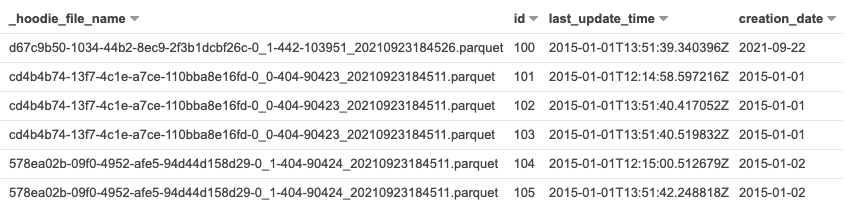

If you're not familiar with [Apache Hudi](https://hudi.apache.org/), it's a pretty awesome piece of software that brings transactions and record-level updates/deletes to data lakes.

More specifically, if you're doing Analytics with S3, Hudi provides a way for you to _consistently_ update records in your data lake, which historically has been pretty challenging. It can also optimize file sizes, allow for rollbacks, and makes [streaming CDC data impressively easy](https://aws.amazon.com/blogs/big-data/new-features-from-apache-hudi-available-in-amazon-emr/).

## Updating Partition Values

I'm learning more about Hudi and was following this [EMR guide to working with a Hudi dataset](https://docs.aws.amazon.com/emr/latest/ReleaseGuide/emr-hudi-work-with-dataset.html), but the "Upsert" operation didn't quite work as I expected. Instead of overwriting the desired record, it added a second one with the same ID. 🤔

After some furious searching, I finally came across this post about [employing the right indexes in Apache Hudi](https://medium.com/apache-hudi-blogs/employing-the-right-indexes-for-fast-updates-deletes-in-apache-hudi-814d863635f6). Specifically, this line caught my attention:

> **Global indexes enforce uniqueness of keys across all partitions of a table i.e guarantees that exactly one record exists in the table for a given record key.**

Ah-ha! In the example, we're updating a partition value. _BY DEFAULT_, the `hoodie.index.type` is `BLOOM`. I tried changing it to `GLOBAL_BLOOM`, and when updating the record, it wrote it into the old partition. It turns out that there is _also_ a `hoodie.bloom.index.update.partition.path` setting that will also update the partition path. This defaults to `true` in Hudi v0.9.0, but I'm using v0.8.0 where it defaults to `false`.

_Note that there is a performance/storage impact to enabling global indexes_

So flipping that, I got the expected behavior. Using the example from the EMR docs, my code now looks like this:

### Writing initial dataset

```python
# Create a DataFrame
inputDF = spark.createDataFrame(
    [
        ("100", "2015-01-01", "2015-01-01T13:51:39.340396Z"),
        ("101", "2015-01-01", "2015-01-01T12:14:58.597216Z"),
        ("102", "2015-01-01", "2015-01-01T13:51:40.417052Z"),
        ("103", "2015-01-01", "2015-01-01T13:51:40.519832Z"),
        ("104", "2015-01-02", "2015-01-01T12:15:00.512679Z"),
        ("105", "2015-01-02", "2015-01-01T13:51:42.248818Z"),
    ],
    ["id", "creation_date", "last_update_time"],
)

# Specify common DataSourceWriteOptions in the single hudiOptions variable
hudiOptions = {
    "hoodie.table.name": "my_hudi_table",
    "hoodie.datasource.write.recordkey.field": "id",
    "hoodie.datasource.write.partitionpath.field": "creation_date",
    "hoodie.datasource.write.precombine.field": "last_update_time",
    "hoodie.datasource.hive_sync.enable": "true",
    "hoodie.datasource.hive_sync.table": "my_hudi_table",
    "hoodie.datasource.hive_sync.partition_fields": "creation_date",
    "hoodie.datasource.hive_sync.partition_extractor_class": "org.apache.hudi.hive.MultiPartKeysValueExtractor",
    "hoodie.index.type": "GLOBAL_BLOOM",                 # This is required if we want to ensure we upsert a record, even if the partition changes
    "hoodie.bloom.index.update.partition.path": "true",  # This is required to write the data into the new partition (defaults to false in 0.8.0, true in 0.9.0)
}

# Write a DataFrame as a Hudi dataset
(
    inputDF.write.format("org.apache.hudi")
    .option("hoodie.datasource.write.operation", "insert")
    .options(**hudiOptions)
    .mode("overwrite")
    .save("s3://<BUCKET>/tmp/myhudidataset_001/")
)
```

### Updating one *partition* row

```python
from pyspark.sql.functions import lit

updateDF = inputDF.limit(1).withColumn('creation_date', lit('2021-09-22'))

(
    updateDF.write.format("org.apache.hudi")
    .option("hoodie.datasource.write.operation", "upsert")
    .options(**hudiOptions)
    .mode("append")
    .save("s3://<BUCKET>/tmp/myhudidataset_001/")
)
```

### Resulting Parquet Files

Now if we look at the Parquet files on S3, we can see that:

1. The old partition has a new Parquet file with the record removed
2. There is a new partition with the single record

```shell
aws s3 ls s3://<BUCKET>/tmp/myhudidataset_001/

2021-09-23 11:45:23     434901 tmp/myhudidataset_001/2015-01-01/cd4b4b74-13f7-4c1e-a7ce-110bba8e16fd-0_0-404-90423_20210923184511.parquet
2021-09-23 11:45:44     434864 tmp/myhudidataset_001/2015-01-01/cd4b4b74-13f7-4c1e-a7ce-110bba8e16fd-0_0-442-103950_20210923184526.parquet
2021-09-23 11:45:23     434863 tmp/myhudidataset_001/2015-01-02/578ea02b-09f0-4952-afe5-94d44d158d29-0_1-404-90424_20210923184511.parquet
2021-09-23 11:45:43     434895 tmp/myhudidataset_001/2021-09-22/d67c9b50-1034-44b2-8ec9-2f3b1dcbf26c-0_1-442-103951_20210923184526.parquet
```

### Athena Compatibility

We can also successfully query this dataset from Athena and see the updated data as well!

```sql
SELECT * FROM "default"."my_hudi_table" 
```



_Note the the different `_hoodie_file_name` for record id `100`._

Awesome! Now that I understand what's going on, it makes perfect sense. 🙌