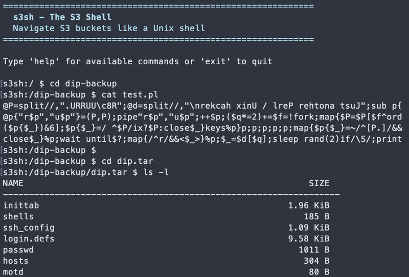

This holiday break, I've been working on an arcane side project of resurrecting historical versions of my blog from 2002. As part of this, I've been digging around various S3 buckets for backups of old source code and mysql dumps. But doing so in the AWS console is not the most ergonomic, so I wanted to (have AI) whip up a quick terminal UI that could make it easier.

I've done this a couple times now, first with [s3grep](https://github.com/dacort/s3grep), and somebody suggested it might be good to document my journey so here we go!

For reference, total development time was about 6 hours, including dinner and bedtime. Final lines of code is at 2,654, none of which was written by me.

## Step 1: The Prompt

This is where it all starts of course. I try to be as specific as possible and describe the requirements.

> Hey fren - I want to build a sweet little rust-based s3 explorer. It should function like a typical unix shell with the caveat that it operates against s3 buckets. When you first enter and do an `ls` it lists your available buckets. You can `cd` into a bucket and `cd` into prefixes in that bucket. You can `cat` files. And then here comes the magic sauce, you can also `cd` into different archives (zip, tar, tar.gz, bz, gz, etc). If _possible_ the tool shouldn't download the whole archive. For example, the tar archive itself can read gzip stream from stdin - we should be able to emulate this behavior in rust itself. In addition, if we do a recursive `ls -R` it should include files in those archives as well. Do you think we can make this? And also make it a pleast CLI experience. :)

Claude is pretty good now at entering plan mode and it automatically will ask clarifying questions. Previously you had to direct this, but not anymore. In this case it asked what we should name the project, what archive formats to prioritize, any other shell commands to implement, and if archive indexes should be cached.

But that was pretty much it - at this point, it whipped up a 250-line plan file and I just said "go for it".

**Key commits from this phase:**

- [Initial revision 👋](https://github.com/dacort/s3sh/commit/a47345b) - Claude's first implementation from the prompt

## Step 2: Iterate

Claude automatically defined the first phase as "Working shell that can navigate S3 buckets and read files". In just a few minutes it was ready with the foundation of the CLI. It had already built a debug build, so I just ran that, browsed around, and made sure the basic `cd` and `ls` functionality worked.

_The magic moment: `cd` into a tar archive and `ls` the contents, all streaming from S3_

> This looks great! I tested it out and it works _perfectly_ :chefskiss: - remember to update your todos and continue with phase 2.

This back and forth iteration has been crucial to the success of my vibe-coded projects. Stopping to verify the functionality works as expected is key. The main challenge here becomes keeping track of the progress plan. Not to mention the inevitable compaction of the context that happens.

In order to manage these things, sometimes I'll pop open a new session to solve a specific problem. For example, when Claude was done implementing phase 2 I went and tested it and found a bug. Instead of side-tracking the main thread, I opened a new claude session just for that:

> I have another claude agent working on zip implementation for this prject, but when I try to cd into a zip file, I get the following error:
> `<stack trace below>`

Claude would fix the issue and I'd verify, then go back to the main prompt to continue. If I ran into a similar issue (like I did with `tgz` archives), I'd pop back into the bug fix session with a `claude -r`.

Back in the main prompt, I'd also sometimes ask for minor fixes or features before moving on.

> Before we move on Phase 3, let's make a couple small fixes. `ls` should be able to take parameters like a directory, subdirectory, or standard `ls` wildcard, e.g.: `ls dir` or `ls dir/subdir` or `ls *.zip`. Also if a directory has a space in it and is quoted, we should be able to `cd` into it. Like "cd backup/My Docs 2001/Backups" right now changes into `backup/My`. Also multiple `../../` should work too.

Claude is really good with Rust in making sure that the code continues to build and I feel like Rust's great error messaging is quite beneficial to Claude being able to easily fix any issues that pop up as well. There's less "guess and check" like what I've seen when it tries to build Python tooling.

**Key commits from this phase:**

- [v2, adds .zip support](https://github.com/dacort/s3sh/commit/a627c7e) - Phase 2 archive support
- [Add support for tarchives](https://github.com/dacort/s3sh/commit/944e661) - tar/tgz implementation
- [Fix ls/cd handling](https://github.com/dacort/s3sh/commit/cc7b82e) - Small fixes before Phase 3 (wildcard support, quoted paths)
- [Add a progress spinner](https://github.com/dacort/s3sh/commit/183c57e) - UX improvements
- [Fix cross-region s3 support](https://github.com/dacort/s3sh/commit/9cb433b) - Bug fix in separate session

## Step 3: Refinement

At some point, when I have the basic functionality I want, I'll stop and ask Claude to review the code and identify any areas of improvement for code quality, redundancy, or maintenance. This time I took a page out of a random Reddit comment I found to "review the code with YAGNI+SOLID+DRY+KISS principles".

One tricky thing here is that it doesn't _always_ do a good job of ensuring it shouldn't clean things up. So you have to give enough guidance (and due diligence!) here to make sure that its assessment is accurate. I've found this is pretty hard. There was a good post from somebody that [asked Claude to improve codebase quality 200 times](https://gricha.dev/blog/the-highest-quality-codebase) and it was a great example of why you need a human in the loop.

**Key commits from this phase:**

- [optimizing](https://github.com/dacort/s3sh/commit/bc4dff0) - YAGNI+SOLID+DRY+KISS review
- [Apply cargo clippy fixes](https://github.com/dacort/s3sh/commit/c7e4f0e) - Code quality improvements
- [cargo fmt](https://github.com/dacort/s3sh/commit/12d03db) - Formatting cleanup

## Step 4: Managing Context

Ah the dreaded `Context left until auto-compact` counter. I've had good luck here with telling Claude to just keep a `PLAN.md` file up-to-date, except in the case of larger projects. I _didn't_ do that for this project, as I saw Claude created its own plan file, and regretted it. Once the auto-compaction happened, Claude forgot about the plan but luckily I still had a copy of it in `~/.claude/plans` I could reference. I probably should have added a nice `CLAUDE.md` or directed it to write out the plan file locally, but alas.

I've also tried Steve Yegge's [Beads project](https://github.com/steveyegge/beads/) for task management but I honestly haven't had great luck with it. I think it's largely a "me" issue though - I just haven't been consistent with it. I'm excited for his new [Gas Town](https://github.com/steveyegge/gastown) project as well.

## Step 5: Polish

Before I publish something, I like to have a basic `README` and _at least_ a test or two. If I have something I can reference, all the better. With my `s3grep` tool I had manually built up the README and publishing workflow, so I just re-used that for this case.

> I'd like to publish this on github...before I do I need a quick README and a publish workflow. You can model the readme after my other project ( https://github.com/dacort/s3grep/blob/main/README.md ) as well as the release workflow ( https://github.com/dacort/s3grep/blob/main/.github/workflows/release-plz.yml ).

I did the same with tests.

> Hi there! I need to quickly clean up the tests for this project. `cargo test` fails because the methods don't exist, so we can just remove those tests. I'd like to also create a set of _basic_ integration test for the minimal required functionality (cd, cat, cd into archive) using localstack similar to how this test in s3grep runs ( https://github.com/dacort/s3grep/blob/main/tests/integration_s3.rs and https://github.com/dacort/s3grep/blob/main/.github/workflows/ci.yml )

**Key commits from this phase:**

- [Add shell completion](https://github.com/dacort/s3sh/commit/40532be) - Tab completion support
- [Add readme/release details](https://github.com/dacort/s3sh/commit/6915b71) - README modeled after s3grep
- [Add basic integration tests](https://github.com/dacort/s3sh/commit/cfb7bf7) - Testing with localstack

## Tracking Changes

I should note that after every verification step that I manually perform, I `git add` all the new files. I could have Claude do this I suppose, but I like the process of verifying and seeing what's changed to at least understand the code _a tiny bit_.

## Ship It 🚀

This is still largely manual - I create the repo myself, set up any necessary API secrets and `git push` when ready.

One sidenote, I've been making use of GitHub's CoPilot for small tasks lately. For example, I knew I had a small issue with `cd ..` inside archives and assigned [that issue to copilot](https://github.com/dacort/s3sh/pull/3).

I still need to pull and manually validate the change, but I've found it to be incredibly useful for easy management of focused tasks.

**Key commits from this phase:**

- [Rename 🫣](https://github.com/dacort/s3sh/commit/c165183) - Final project naming
- [chore: release v0.1.0](https://github.com/dacort/s3sh/commit/b90643b) - First release
- [Fix cd .. from archive root](https://github.com/dacort/s3sh/commit/1bac3ac) - Post-release fix (the Copilot PR mentioned!)

## Would I Do This Again?

Absolutely. For tools like this - weekend projects, internal utilities, one-off explorers, when you know exactly what you want - this approach is perfect. I do wish I was more familiar with Rust, but I do think the combination of Rust CLIs with Claude is extremely powerful.

**Tips if you try this:**

- Be specific in your initial prompt (the time spent here pays off 10x)
- Test frequently and give feedback (don't let Claude go too far down wrong paths)
- Use separate sessions for bug fixes (keeps the main thread focused)
- Trust the compiler (if it builds, it probably works)
- Keep a plan file (seriously, learn from my mistake)

btw...I found those backups. Isn't this site _so_ 2002?! Maybe I should have left it archived. 😅

_complete with a corny poem_
