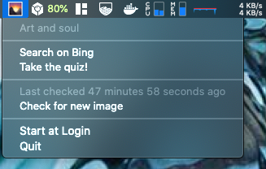

If you weren't aware, [Bing.com](https://www.bing.com/) has an _awesome_ image of the day. 

Even better, they have a [daily quiz](https://www.bing.com/search?q=Bing+homepage+quiz&filters=WQOskey:%22HPQuiz_20210601_PoetrysCave%22&FORM=HPQUIZ)(!) for every image. 

I like both a/ beautiful wallpapers and b/ mini-quizzes so I wrote a little macOS menubar app that updates the wallpaper daily with the Bing image of the day and also gives you a little link where you can take the quiz.



## Installation

Either download from my [GitHub releases](https://github.com/dacort/bingdaily/releases) or use Homebrew.

```shell
brew tap dacort/formulas
brew install bingdaily
```