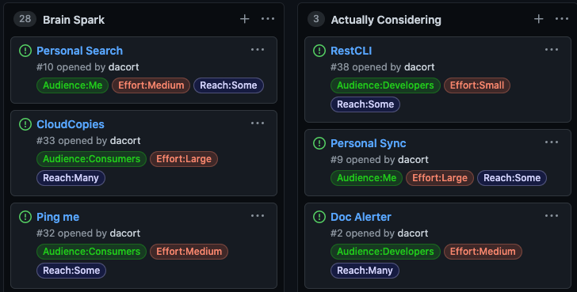

I love building. I often whip up quick little utilities to make my life easier or sometimes just to have fun with a project. 

I believe ideas should be freely available - it's the execution of an idea that turns it into something larger. As such, I try to document all the random ideas I have in my [personal GitHub](https://github.com/dacort/ideas/projects/1).

Feel free to go check them out and let me know if you find anything interesting. I often find happiness in making other's lives easier so if something we both want happens to be on the list, [let me know](https://twitter.com/intent/tweet?text=Hey%20%40dacort%2C%20I%20really%20like%20one%20of%20your%20ideas!)!